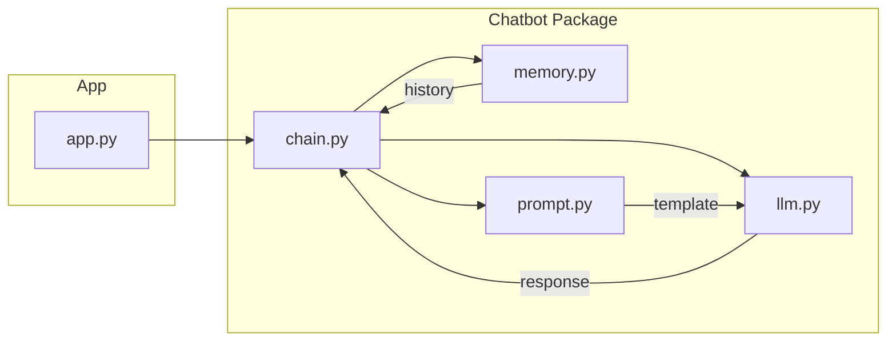

# smart-chatbot

A lightweight Python project that demonstrates a smart conversational chatbot with memory and customizable prompting. It's designed as a minimal example so developers can learn about building chatbots using modern LLMs, managing conversational state, and deploying the system in a containerized environment.

## 🧩 Problem
Traditional chatbots lack context retention and struggle with coherent multi-turn conversations. Developers also face friction when setting up an environment or deploying the app consistently across machines.

## 🔍 Approach
1. **Modular code structure** - separation of concerns between language model interface, conversation chain, and memory management.
2. **Prompt engineering** - templates define how user inputs are transformed before being sent to the LLM.
3. **In-memory state** - simple memory component stores messages to provide context across turns.
4. **Containerization** - a `Dockerfile` allows anyone to build and run the chatbot reproducibly.

## 🏗️ System Design
- `app.py` – entry point that wires together components and exposes an interface (CLI or web).
- `chatbot/llm.py` – abstraction around the language model (e.g. OpenAI, local LLMs).
- `chatbot/chain.py` – orchestrates message flow: receives input, consults memory, formats prompt, queries LLM, and updates memory.
- `chatbot/memory.py` – simple conversation history store.
- `chatbot/prompt.py` – prompt templates and helper functions.

The architecture emphasizes easy replacement of the LLM backend and extensible memory strategies.

### 📊 Architecture Diagram


## 🚀 Running the Project
### Prerequisites
- Docker installed on your machine (Desktop, Engine, etc.)
- Git for cloning the repository

### Steps
1. Clone the repo:
   ```bash
   git clone https://github.com/<your-org>/smart-chatbot.git
   cd smart-chatbot
   ```
2. Build the Docker image:
   ```bash
   docker build -t smart-chatbot:latest .
   ```
3. Run a container:
   ```bash
   docker run --rm -it smart-chatbot:latest
   ```

> **Note:** The container expects any required API keys (e.g. for OpenAI) to be provided via environment variables. You can pass them when running the container:
> ```bash
> docker run --rm -it -e OPENAI_API_KEY=$OPENAI_API_KEY smart-chatbot:latest
> ```

### Local Development (without Docker)
1. Create a Python virtual environment: `python -m venv venv`
2. Activate it: `.
venv\Scripts\activate` (Windows) or `source venv/bin/activate` (macOS/Linux)
3. Install dependencies: `pip install -r requirements.txt`
4. Run the app:
   ```bash
   python app.py
   ```

---

Feel free to adapt the components or extend the memory system for more sophisticated conversational agents.